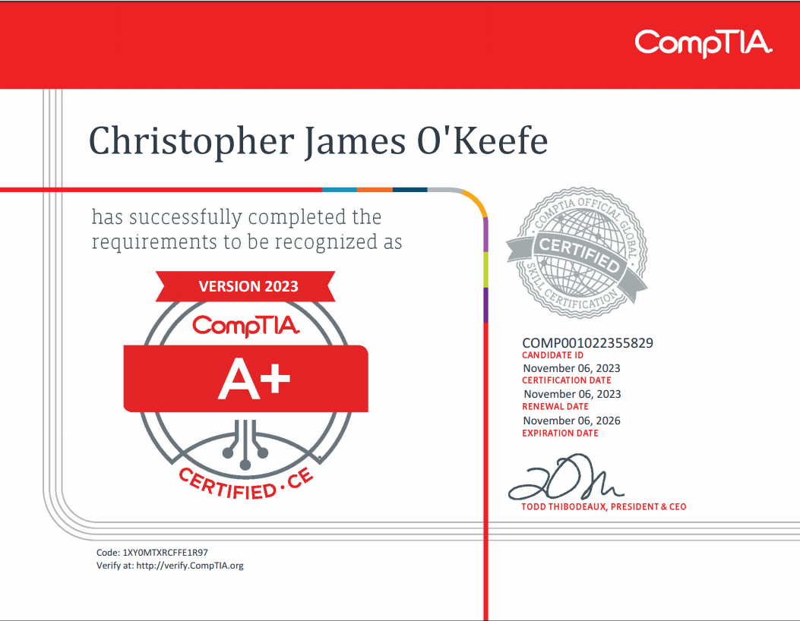

---

# Cybersecurity Portfolio 

*Showcase My Skills for My Future Employer*

---

## Links

Here are some useful links related to my work and learning:

- [GitHub](https://github.com/TheCaptainCJ)
- [LinkedIn](https://www.linkedin.com/in/christopherokeefe93/)
- [TryHackMe Profile](https://tryhackme.com/p/Chritikal)

---

## My Work

### Malware Analysis Screenshots

 
 

### 

*Add more images as needed to highlight your projects.*

---

## Certifications

---

## Project Documents

### Cybersecurity Incident Report: Network Traffic Analysis

- **Summary**: Provides a detailed analysis of DNS and ICMP traffic issues, including troubleshooting steps and mitigation strategies.
- [View Document](Chris_OKeefe_Malware_Analysis_Complete.docx)

### Network Documentation Assignment

- **Overview**: Comprehensive documentation of network devices, configurations, and security policies for a fictional enterprise environment.
- [View Document](My_Network_Documentation_assignment.docx)

---

## Skills

Here are the classes I am studying and what I have learned:

- **Enterprise Networking Foundation**: Gained foundational knowledge of enterprise-level networking concepts and protocols.
- **Cybersecurity Programming Foundation**: Developed skills in programming specifically tailored to cybersecurity tasks.
- **IoT Foundation: Connecting Things**: Learned about securing Internet of Things (IoT) devices and their communication.
- **Big Data & Analytics Foundation**: Explored methods for analyzing and securing large-scale data.
- **Cybersecurity Foundation**: Acquired a broad understanding of core cybersecurity principles and practices.
- **Cybersecurity Penetration Testing**: Hands-on experience with penetration testing tools and techniques.
- **Cybersecurity Analyst**: Learned to monitor and analyze security incidents and responses.
- **Cybersecurity Operations**: Gained insights into managing and securing operational cybersecurity environments.

---

## Security+ Terminology

Here’s an organized list of key cybersecurity terms:

1. **Confidentiality**: Ensuring information is not disclosed to unauthorized individuals.
2. **Integrity**: Protecting data from being altered or tampered with.
3. **Availability**: Ensuring systems and data are accessible when needed.
4. **Encryption**: Converting data into a secure format to prevent unauthorized access.
5. **Firewall**: A security device that monitors and controls incoming and outgoing network traffic.
6. **Phishing**: A cyberattack where attackers trick individuals into providing sensitive information.
7. **Zero-Day Exploit**: A vulnerability that is exploited before a patch is available.
8. **Authentication**: Verifying the identity of a user, system, or entity before granting access.
9. **Authorization**: Granting permissions and access to resources based on authenticated identity.
10. **Multi-Factor Authentication (MFA)**: Using two or more authentication methods to verify identity.
11. **Malware**: Software designed to disrupt, damage, or gain unauthorized access to systems.
12. **Ransomware**: Malware that encrypts a victim’s files and demands payment for their release.
13. **Denial-of-Service (DoS)**: An attack that disrupts services by overwhelming them with traffic.
14. **Botnet**: A network of infected devices controlled by an attacker to perform malicious tasks.
15. **Social Engineering**: Manipulating individuals to divulge confidential information or perform actions.
16. **Man-in-the-Middle (MitM) Attack**: Intercepting communication between two parties to steal data.
17. **Public Key Infrastructure (PKI)**: A framework for managing digital certificates and encryption keys.
18. **Intrusion Detection System (IDS)**: Monitors network traffic for suspicious activity and potential threats.
19. **Intrusion Prevention System (IPS)**: Actively blocks detected threats in real time.
20. **Patch Management**: Updating software to fix vulnerabilities or improve functionality.

---

[View on GitHub](https://github.com/yourusername/file-organizer) | [Download Script]()

---

*This portfolio is designed to demonstrate my skills and capabilities in cybersecurity, paving the way for my professional journey.*
