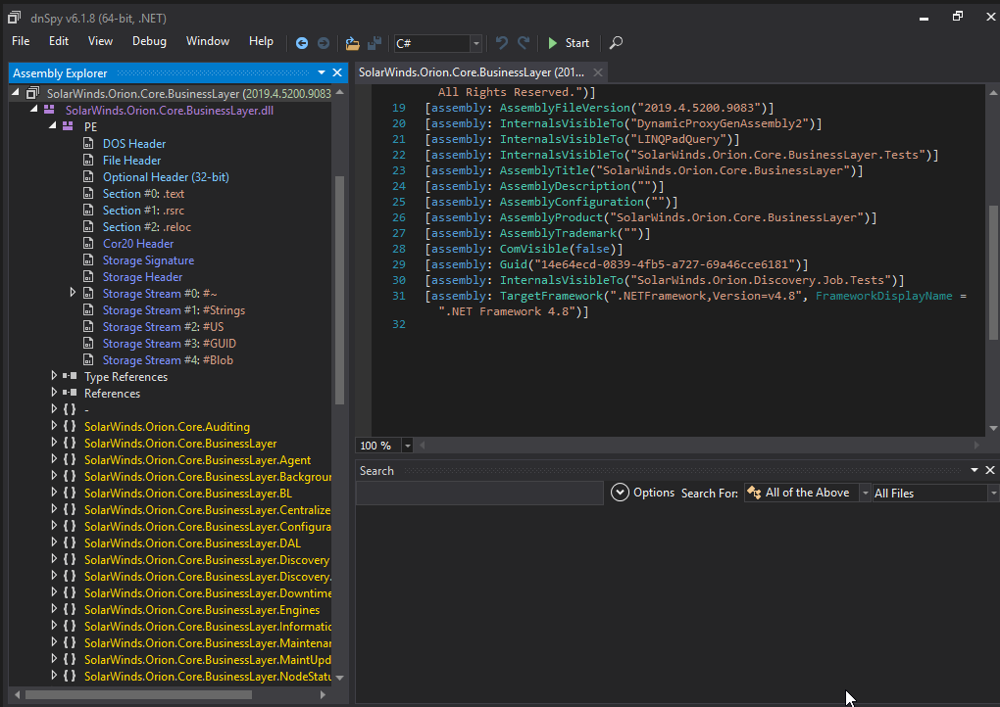
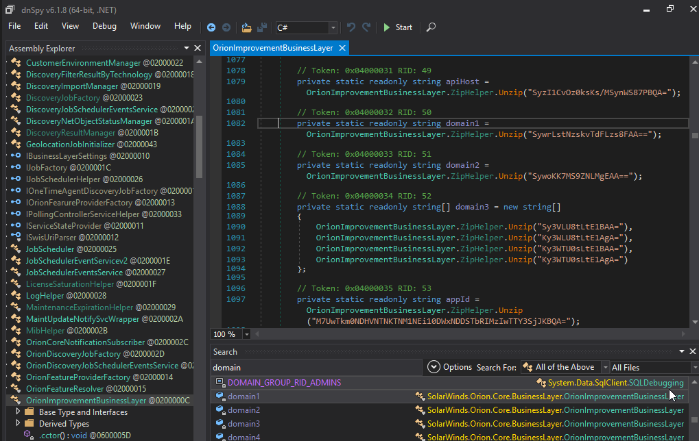
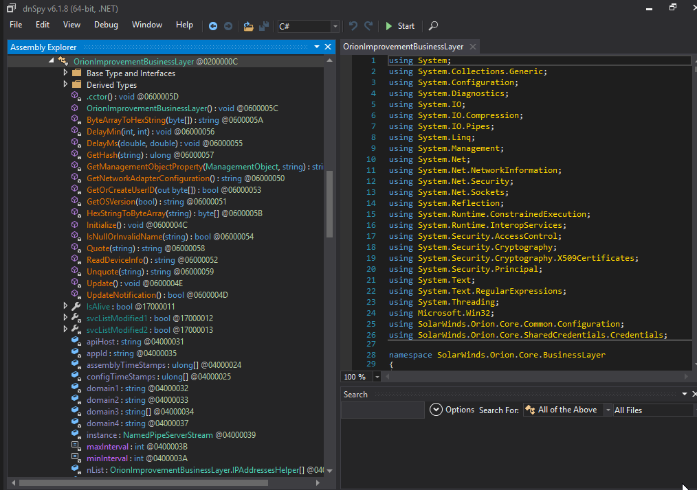
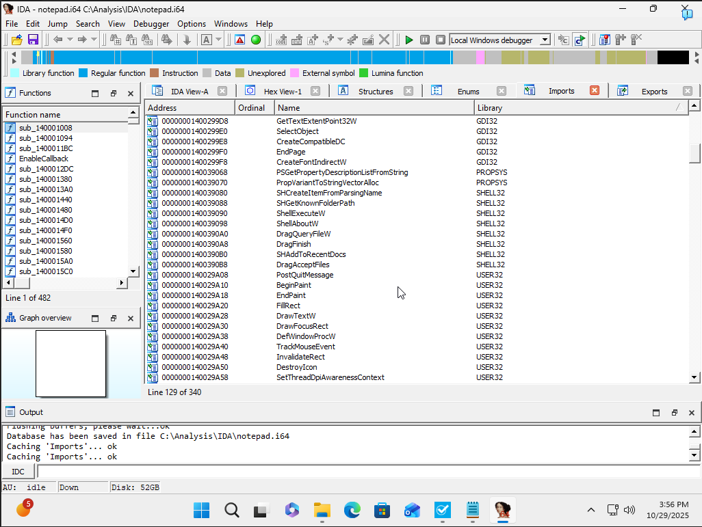

# Leveling up Cybersecurity skills
---

# Cybersecurity Portfolio 

*Showcase My Skills for My Future Employer*

---

## Links

Here are some useful links related to my work and learning:

- [LinkedIn](https://www.linkedin.com/in/christopherokeefe93/) *Try to stay connect online network*
- [TryHackMe Profile](https://tryhackme.com/p/Chritikal) *TryHackme is a place I use to keep learning and growing*
---

## My Work

### Malware Analysis for SolarWinds Malware (DnSpy)

*Malware showcasing Businesslayer*

*Malware 'businessimprovementlayer' domains*

*Malware backdoor*

### SolarWinds Malware assignment download.

- **Summary**: Provides an understanding of what to do when you need to find malware through code on dnspy.
- [View Document](Malware_assignment.docx)

### Wireshark Analysis

### Pestudio Assessment

### IDA Example

---

## Certifications

*Looking to get more in the future!*

---

## Project Documents

### Cybersecurity Capstone Project: Understanding malware and how to deal with it safely.

- **Summary**: Provides a detailed Report I made on how to safely deal with Malware.
- [View Document](Chris_OKeefe_Malware_Analysis_Complete.docx)

### Networking Capstone: Network Documentation 

- **Overview**: Comprehensive documentation of network devices, configurations, and security policies for a fictional enterprise environment.
- [View Document](My_Network_Documentation_assignment.docx)

---

## Skills

Here are the classes I am studying (Cybersecurity Bachelors) and what I have learned:

- **Enterprise Networking Foundation**: Gained foundational knowledge of enterprise-level networking concepts and protocols.
- **Cybersecurity Programming Foundation**: Developed skills in programming specifically tailored to cybersecurity tasks.
- **IoT Foundation: Connecting Things**: Learned about securing Internet of Things (IoT) devices and their communication.
- **Big Data & Analytics Foundation**: Explored methods for analyzing and securing large-scale data.
- **Cybersecurity Foundation**: Acquired a broad understanding of core cybersecurity principles and practices.
- **Cybersecurity Penetration Testing**: Hands-on experience with penetration testing tools and techniques.
- **Cybersecurity Analyst**: Learned to monitor and analyze security incidents and responses.
- **Cybersecurity Operations**: Gained insights into managing and securing operational cybersecurity environments.

---

*This portfolio is designed to demonstrate my skills and capabilities in cybersecurity, paving the way for my professional journey.*
